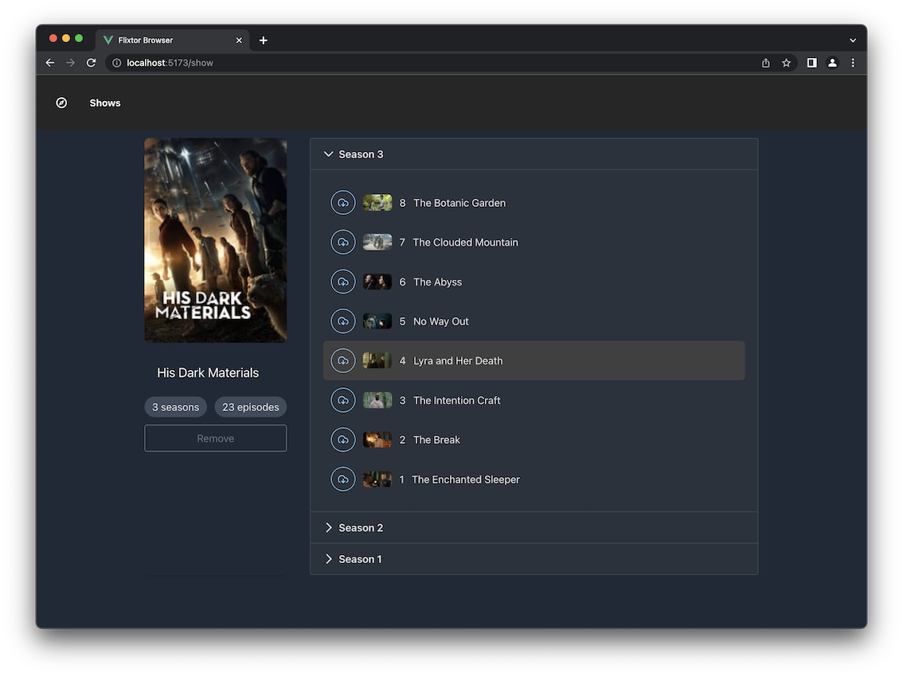

<div align="center">

# Dionysius-Browser: Elevate Your Movie & TV Show Experience 🍿

Experience the future of tracking and managing your movie and TV show viewing with Dionysius-Browser, an all-in-one, feature-rich solution designed to make your entertainment journey seamless and personalized.



</div>

<p align="center">
  Built with love using
  <a href="https://vuejs.org/">Vue.js</a> •
  <a href="https://expressjs.com/">Express.js</a> •
  <a href="https://www.mongodb.com/">MongoDB</a> •
  <a href="https://www.docker.com/">Docker</a> •
  <a href="https://nginx.org/">Nginx</a> •
  and many more
</p>

## Tech stack

<a href="https://developer.mozilla.org/en-US/docs/Web/JavaScript" title="JavaScript"></a>
<a href="https://vuejs.org/" title="Vue.js"></a>
<a href="https://www.w3.org/TR/CSS/" title="CSS3"></a>
<a href="https://sass-lang.com/" title="Sass"></a>
<a href="https://tailwindcss.com/" title="Tailwind CSS"></a>
<a href="https://www.w3.org/TR/html5/" title="HTML5"></a>
<a href="https://nodejs.org/" title="Node.js"></a>
<a href="https://expressjs.com/" title="Express"></a>
<a href="https://git-scm.com/" title="Git"></a>
<a href="https://www.npmjs.com/" title="npm"></a>
<a href="https://vitejs.dev/" title="Vite"></a>
<a href="https://eslint.org/" title="ESLint"></a>
<a href="https://prettier.io/" title="Prettier"></a>
<a href="https://code.visualstudio.com/" title="Visual Studio Code"></a>
<a href="https://www.docker.com/" title="docker"></a>

## 🚀 Quick Links

- [Status](#-status)
- [Architecture](#-architecture)
- [Getting Started](#-getting-started)
- [Contribution](#-contribution)
- [FAQs](#-faqs)
- [Contact](#-contact)
- [License](#-license)

## 📈 Status

Dionysus-Browser is in its zenith of development. We are relentlessly working on expanding our movie sources and curating personalized show recommendations based on your viewing history. We forecast to complete this phase by Q4 2023.

## 🏗️ Architecture

Dionysus-Browser is built upon a microservices architecture, consisting of five main components. Each component plays a vital role, and they are interlaced through Docker Compose for robust system management and scalability:

- **User Interface (UI)**: Powered by Vue.js, the frontend delivers an intuitive and responsive user experience.
- **Middleware API**: An Express.js server that forms the bridge between the frontend and the database, managing all business logic.
- **MongoDB Database**: The central data repository for Dionysus-Browser, holding all user data and movie/show metadata.
- **Mongo-Express**: A web-based MongoDB admin interface that aids in managing and debugging the MongoDB instance.
- **Internal Nginx Proxy**: A critical component directing internal traffic between the UI, Middleware API, MongoDB Database, and Mongo-Express as per the defined rules.

```
[UI] <--> [Internal Proxy] <-->  [Middleware]
            | |
          [MongoDB]  <--> [Mongo-Express]
```

## 🚀 Getting Started

To run Dionysus-Browser locally:

1. Clone this repository.
2. At the repository root, execute `docker compose up`.
3. Access the web app at `localhost:18000`.

Please ensure your system meets the following requirements:

- Node.js (v14.0 or later)
- Docker (v20.10.6 or later)
- Docker Compose (v1.29.1 or later)
- A modern web browser

## 👩‍💻 Contribution

We welcome contributions! Feel free to fork the repository, make changes, and submit a pull request. If you spot any issues, report them in the issue tracker. For substantial changes, open an issue first to discuss your proposals.

## 🐞 Known Bugs & Fixes

As of now, we have not identified any bugs in the system. If you come across any, please report them via the issue tracker. We will provide updates regarding bug fixes as they become available.

## ❓ FAQs

1. **Q: How often are new movie sources integrated?**  
   A: We're continually working to integrate new movie sources. The frequency depends on the development schedule and user demand.

2. **Q: Can I contribute?**  
   A: Absolutely! Refer to the [Contribution](#-contribution) section for more details.

3. **Q: Are there plans for a mobile version?**  
   A: Yes, a mobile version of Dionysus-Browser is on our roadmap.

4. **Q: How can I report bugs or suggest features?**  
   A: Use the issue tracker to report bugs or suggest new features. We appreciate your feedback and contributions.

5. **Q: How can I modify the MongoDB schema?**
   A: You can modify the MongoDB schema in the `models` directory in the `api/` directory. After making changes, restart the server for them to take effect.

## 📜 License

Dionysus-Browser is licensed under the MIT License. See the LICENSE file for more details.

## 📞 Contact

If you have any questions, issues, or suggestions, feel free to contact us through the issue tracker.
